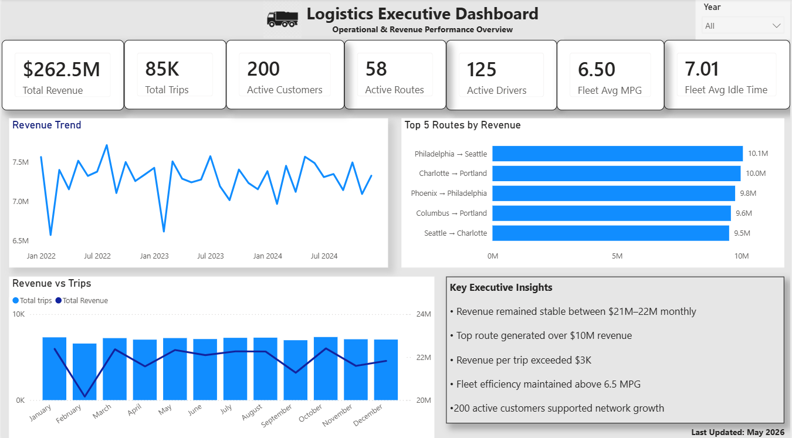
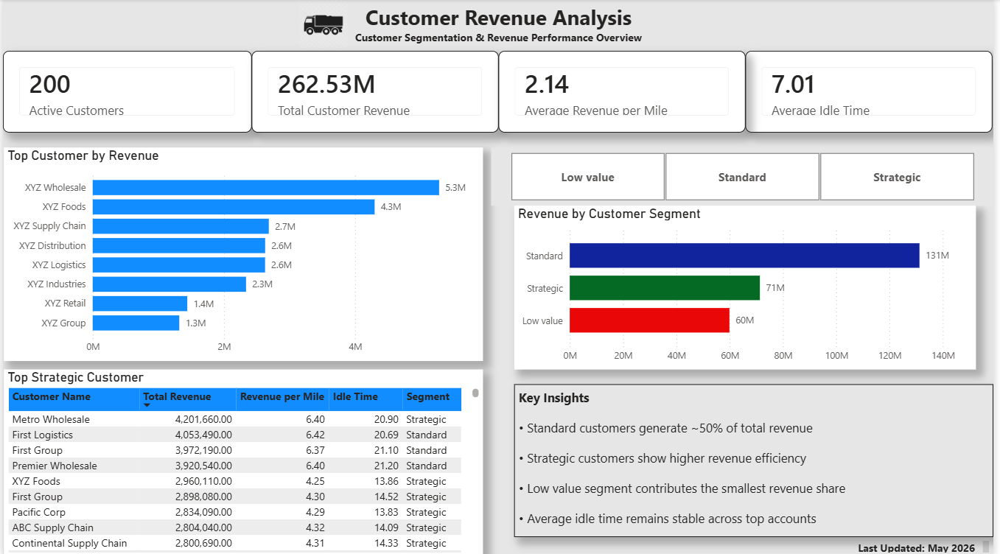
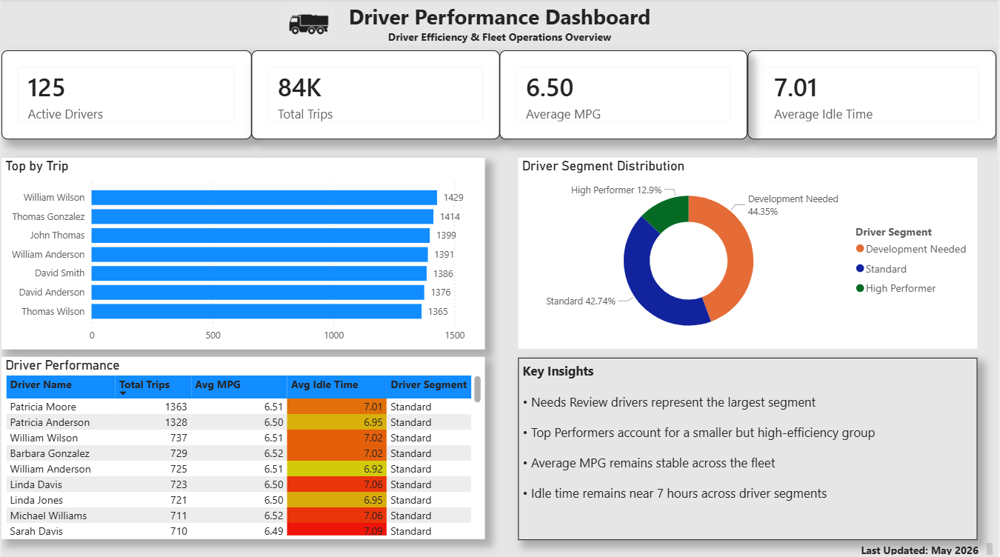

# Logistics Performance Analysis

## Project Overview

This project analyzes logistics and transportation operations using SQL and Power BI.

The objective was to identify operational trends, evaluate customer and driver performance, monitor fleet efficiency, and provide business recommendations based on data.

The analysis was performed on a logistics dataset containing information about customers, routes, drivers, trips, loads, and trucks.

---

## Business Problem

Logistics companies generate large volumes of operational data every day. Without proper analysis it is difficult to identify:

- Which customers generate the most revenue
- Which routes perform best
- How driver performance impacts operations
- Whether fleet utilization is efficient
- Which operational metrics require management attention

The goal of this project was to transform raw logistics data into actionable business insights through SQL analysis and interactive Power BI dashboards.

---

## Data Sources

The project uses a logistics operations dataset containing information about:

- Customers
- Loads
- Trips
- Routes
- Drivers
- Trucks
- Fuel Purchases
- Maintenance Records
- Safety Incidents
- Delivery Events

Only datasets relevant to the business questions analyzed in this project were used for dashboard development.

---

## Business Questions

### Executive Dashboard

- How is revenue changing over time?
- Which routes generate the highest revenue?
- How many active customers, drivers, and routes are currently operating?
- What are the key operational KPIs?

### Customer Revenue Analysis

- Which customers contribute the most revenue?
- What percentage of revenue comes from each customer segment?
- Which customer segments are most valuable?
- What customer characteristics are associated with higher revenue generation?

### Driver Performance Analysis

- Which drivers complete the most trips?
- How efficient are drivers in terms of fuel consumption (MPG)?
- Which driver segments dominate fleet operations?
- How does idle time vary across drivers?

---

## Dataset

The project uses multiple logistics-related datasets:

- Customers
- Drivers
- Loads
- Routes
- Trips
- Trucks

Additional datasets were available for future analysis:

- Safety incidents
- Fuel purchases
- Maintenance records
- Trailer information
- Facilities

---

## Tools Used

- PostgreSQL
- SQL
- DBeaver
- Power BI
- GitHub

---

## SQL Analysis

The project includes several SQL views created to support dashboard development.

### Views Created

| View | Purpose |
|--------|---------|
| route_performance_view | Route-level revenue and efficiency analysis |
| customer_performance_view | Customer segmentation and revenue performance |
| monthly_performance_view | Monthly trends and KPI tracking |
| driver_performance_view | Driver efficiency and operational performance |
| executive_dashboard_view | Executive KPI aggregation |
| driver_safety_view | Driver incident and safety analysis |
| driver_segment_revenue_view | Revenue contribution by driver segment |

---

## Dashboards

### 1. Logistics Executive Dashboard



#### Provides a high-level operational overview including:

- Total Revenue
- Total Trips
- Active Customers
- Active Drivers
- Active Routes
- Fleet MPG
- Fleet Idle Time
- Revenue Trends
- Top Revenue Routes

#### Key Insight

- Revenue remained stable throughout the analyzed period.
- A small number of routes generated a disproportionate share of revenue.
- Revenue per trip exceeded $3K, indicating strong route profitability.
- Fleet fuel efficiency remained consistently above 6.5 MPG.
- The business maintained a diversified customer base of 200 active customers.


### 2. Customer Revenue Analysis



Focuses on customer profitability and segmentation.

#### Key visuals include:

- Top Revenue Generating Customers
- Revenue Distribution by Customer Segment
- Customer Profitability Overview
- Strategic Customer Analysis

#### Key Insight

- Standard customers generated the largest share of total revenue.
- Strategic customers achieved higher revenue efficiency per mile.
- Revenue concentration among top customers indicates potential dependency risk.
- Customer segmentation highlights opportunities for account growth and retention.

### 3. Driver Performance Dashboard



Analyzes operational efficiency at the driver level.

#### Key visuals include:

- Top Drivers by Trip Volume
- Driver Segment Distribution
- Driver Efficiency Comparison
- Fuel Economy Performance
- Idle Time Monitoring

#### Key Insight

- Nearly 90% of drivers are classified as Standard or Needs Review, indicating significant potential for operational improvement.
- Top Performers account for a small portion of the fleet but demonstrate the strongest overall efficiency.
- Fuel consumption performance remains stable across the driver population.
- Reducing idle time could improve asset utilization and lower operating costs.

---

## Key Findings

### Revenue Performance

- Revenue remained relatively stable throughout the analyzed period.
- A small number of routes generated a disproportionately large share of revenue.
- Customer revenue concentration indicates dependence on several high-value accounts.

### Customer Analysis

- Standard customers generated approximately 50% of total revenue.
- Strategic customers demonstrated stronger revenue efficiency.
- Customer segmentation helps identify opportunities for targeted account management.

### Driver Performance

- Most drivers belong to the Standard segment.
- Top Performers represent a smaller but highly efficient group.
- Fleet MPG remains relatively stable across driver segments.
- Idle time remains consistent but offers opportunities for operational improvement.

---

## Business Recommendations

### Revenue Growth

- Increase focus on high-performing routes.
- Expand relationships with strategic customers.
- Identify opportunities to replicate successful route models.

### Customer Management

- Develop retention strategies for top revenue customers.
- Create incentive programs for high-value accounts.
- Monitor customer concentration risk.

### Fleet Operations

- Reduce idle time where possible.
- Use driver segmentation to support performance management.
- Share best practices from top-performing drivers across the fleet.

---

## Project Structure

```text
logistics-performance-analysis/

├── README.md

├── sql/
│   ├── 01_schema_exploration.sql
│   ├── 02_data_quality.sql
│   ├── 03_route_performance_view.sql
│   ├── 04_customer_performance_view.sql
│   ├── 05_monthly_performance_view.sql
│   ├── 06_driver_performance_view.sql
│   ├── 07_executive_dashboard_view.sql
│   ├── 08_advanced_analysis.sql
│   ├── 09_driver_safety_view.sql
│   └── 10_driver_segment_revenue_view.sql

├── screenshots/
│   ├── executive_dashboard.png
│   ├── customer_revenue_analysis.png
│   └── driver_performance_dashboard.png

└── powerbi/
    └── logistics_dashboard.pbix
```

---

## Future Improvements

Potential future enhancements include:

- Driver safety analysis
- Predictive maintenance analysis
- Fuel cost optimization
- Delivery delay analysis
- Route profitability forecasting
- KPI monitoring with automated refresh

---

## Author

Damian Kuś

Aspiring Data Analyst focused on SQL, Power BI, and business intelligence projects.

---